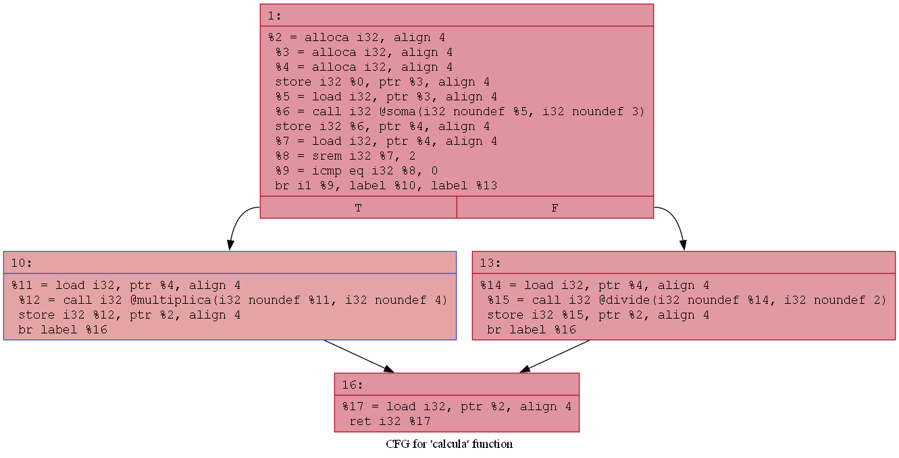

# Código C e Geração de IR

##  Pergunta 1: Como estão representadas as funções `soma`, `multiplica` e `calcula` em IR?

No LLVM IR, as funções do código C são representadas pela diretiva `define`, com os tipos de entrada, retorno e as instruções em linguagem intermediária. Cada parâmetro é identificado por `%` seguido de um número (ex: `%0`, `%1`), e as instruções são expressas em estilo SSA.

### Função `soma`:

```llvm
define dso_local i32 @soma(i32 noundef %0, i32 noundef %1) #0 {
  %3 = alloca i32, align 4
  %4 = alloca i32, align 4
  store i32 %0, ptr %3, align 4
  store i32 %1, ptr %4, align 4
  %5 = load i32, ptr %3, align 4
  %6 = load i32, ptr %4, align 4
  %7 = add nsw i32 %5, %6
  ret i32 %7
}
```

### Função `multiplica`:

```llvm
define dso_local i32 @multiplica(i32 noundef %0, i32 noundef %1) #0 {
  %3 = alloca i32, align 4
  %4 = alloca i32, align 4
  store i32 %0, ptr %3, align 4
  store i32 %1, ptr %4, align 4
  %5 = load i32, ptr %3, align 4
  %6 = load i32, ptr %4, align 4
  %7 = mul nsw i32 %5, %6
  ret i32 %7
}
```

### Função `calcula`:

```llvm
define dso_local i32 @calcula(i32 noundef %0) #0 {
  %2 = alloca i32, align 4
  %3 = alloca i32, align 4
  store i32 %0, ptr %3, align 4
  %4 = load i32, ptr %3, align 4
  %5 = icmp sgt i32 %4, 10
  br i1 %5, label %6, label %9

6:                                                ; preds = %1
  %7 = load i32, ptr %3, align 4
  %8 = call i32 @multiplica(i32 noundef %7, i32 noundef 2)
  store i32 %8, ptr %2, align 4
  br label %12

9:                                                ; preds = %1
  %10 = load i32, ptr %3, align 4
  %11 = call i32 @soma(i32 noundef %10, i32 noundef 5)
  store i32 %11, ptr %2, align 4
  br label %12

12:                                               ; preds = %9, %6
  %13 = load i32, ptr %2, align 4
  ret i32 %13
}
```
---

## Pergunta 2: O que aparece no IR que representa a condição `if (valor > 10)`?

A condição `valor > 10` é representada em LLVM IR pelas instruções de comparação (`icmp`) e salto condicional (`br`).

```llvm
%5 = icmp sgt i32 %4, 10
br i1 %5, label %6, label %9
```

## Pergunta 3: Como são representadas as chamadas às funções auxiliares em IR?

As chamadas às funções auxiliares como `soma` e `multiplica` são representadas com a instrução `call`, especificando a função, os tipos de parâmetros e os valores passados.

### Chamada à função `multiplica`:

```llvm
%7 = load i32, ptr %3, align 4
%8 = call i32 @multiplica(i32 noundef %7, i32 noundef 2)
store i32 %8, ptr %2, align 4
```

### Chamada à função `soma`:

```llvm
%10 = load i32, ptr %3, align 4
%11 = call i32 @soma(i32 noundef %10, i32 noundef 5)
store i32 %11, ptr %2, align 4
```

# Modificação do Código

## Pergunta 1: Como o `if (temp % 2 == 0)` aparece no IR?

No LLVM IR, essa condição é decomposta em duas partes:
1. O cálculo do módulo (`temp % 2`)
2. A comparação se o resultado é igual a zero

### Trecho do IR correspondente:

```llvm
%8 = srem i32 %7, 2
%9 = icmp eq i32 %8, 0
br i1 %9, label %10, label %13
```
---

## Pergunta 2: Como o operador `%` (módulo) é representado no LLVM IR?

O operador `%` é representado no LLVM IR pela instrução:

```llvm
srem i32 <op1>, <op2>
```

### Exemplo no IR:

```llvm
%7 = srem i32 %6, 2
```

## Pergunta 3: Quais são os blocos básicos criados pela nova lógica condicional?

A lógica condicional `if (temp % 2 == 0)` cria no IR **quatro blocos básicos** distintos na função `@calcula`:


### 1. **Bloco de condição**

Avalia `temp % 2 == 0` e decide o salto condicional:

```llvm
%8 = srem i32 %7, 2
%9 = icmp eq i32 %8, 0
br i1 %9, label %10, label %13
```


### 2. **Bloco `%10` (condição verdadeira)**

Executa `multiplica(temp, 4)`:

```llvm
%11 = load i32, ptr %4, align 4
%12 = call i32 @multiplica(i32 noundef %11, i32 noundef 4)
store i32 %12, ptr %2, align 4
br label %16
```


### 3. **Bloco `%13` (condição falsa)**

Executa `divide(temp, 2)`:

```llvm
%14 = load i32, ptr %4, align 4
%15 = call i32 @divide(i32 noundef %14, i32 noundef 2)
store i32 %15, ptr %2, align 4
br label %16
```


### 4. **Bloco `%16` (bloco de saída)**

Unifica os fluxos de controle e retorna o valor calculado:

```llvm
%17 = load i32, ptr %2, align 4
ret i32 %17
```

# Otimização com opt

## Pergunta 1: Que mudanças ocorreram na função `main` após a otimização?

A função `main` **permanece praticamente inalterada**. 
### Mudanças observadas:

 A função foi marcada como `local_unnamed_addr`, o que **não altera a lógica**, mas permite mais agressivas otimizações de endereço (indica que o endereço da função não importa).
 **Nenhuma eliminação ou fusão de instruções intermediárias** foi realizada nessa versão otimizada.

## Pergunta 2: Alguma função foi *inlined* (inserida diretamente)? Como identificar?

Não. Nenhuma função foi *inlined*.

As funções auxiliares (`soma`, `multiplica`, `calcula`) continuam sendo **chamadas externamente**, ou seja, **não foram embutidas** no corpo de `main`.

 A função `main` ainda contém:
  ```llvm
  %3 = call i32 @calcula(i32 noundef 7)
  ```
  O que indica chamada real à função `@calcula`, e não substituição por seu corpo.

 As funções auxiliares (`@soma`, `@multiplica`, `@calcula`) também estão **definidas normalmente** no IR, e não foram marcadas como `alwaysinline` nem otimizadas fora.

## Pergunta 3: Alguma variável intermediária foi eliminada? Por quê?

Nenhuma variável intermediária foi eliminada no `main`.

 O código está **com os atributos `optnone`**, o que **desativa otimizações mesmo após uso de `opt`**, a menos que o atributo seja removido.
A flag `noinline` também impede *inlining*.


# Visualizando o Grafo de Fluxo de Controle (CFG)




## 1. Quantos blocos básicos você consegue identificar na função `calcula`?

Identificamos **quatro blocos básicos** no grafo:

1. **Bloco `%1`**: bloco de entrada e avaliação da condição (`temp % 2 == 0`)
2. **Bloco `%10`**: ramo do `if` (condição verdadeira)
3. **Bloco `%13`**: ramo do `else` (condição falsa)
4. **Bloco `%16`**: bloco final de retorno


## 2. Quais são os caminhos possíveis a partir da condição `if (temp % 2 == 0)`?

A condição está implementada no **bloco `%1`**, que avalia:

```llvm
%8 = srem i32 %7, 2
%9 = icmp eq i32 %8, 0
br i1 %9, label %10, label %13
```

### Caminhos possíveis:

Se a condição **for verdadeira** (`temp % 2 == 0`): o fluxo segue para o **bloco `%10`**
Se a condição **for falsa**: o fluxo segue para o **bloco `%13`**

Ambos os caminhos convergem no **bloco `%16`** após suas execuções.

## 3. O fluxo de controle inclui blocos de erro ou casos não triviais (e.g., retorno precoce)?

### Não.

Não há blocos que interrompem o fluxo abruptamente (como `return` antecipado ou `unreachable`). Não há checagens de erro dentro da função `calcula` no CFG mostrado. A função segue um fluxo **linear com bifurcação simples**, com reconvergência no final.

## 4. Há blocos com apenas instruções de salto? O que você imagina que isso indica?

Sim: o **bloco `%16`** tem apenas:

```llvm
%17 = load i32, ptr %2, align 4
ret i32 %17
```

É um bloco que só faz o carregamento da variável de resultado e a retorn. Não realiza mais cálculos ou condições, além de que é um ponto de convergência: tanto `%10` quanto `%13` terminam com `br label %16`.